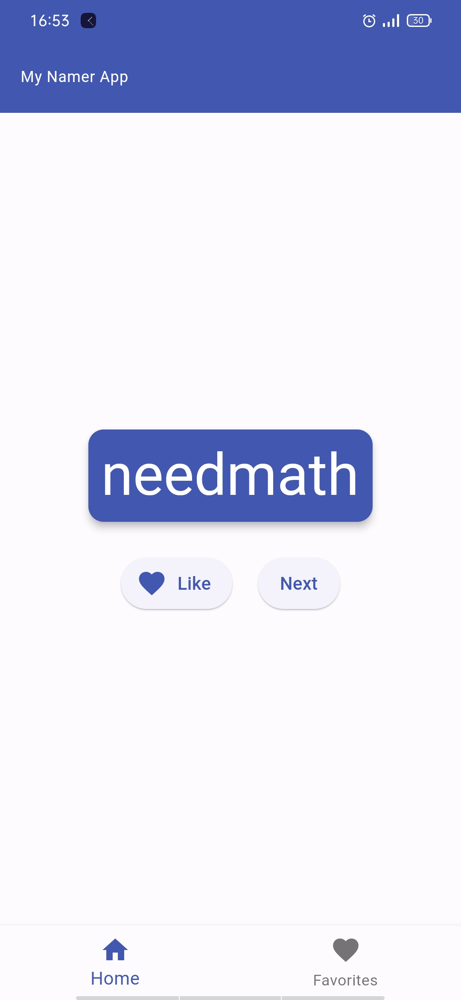

# my_namer_app

My second flutter project from google code labs which i re-created.

### app screenshot on android

## what i learnt

- stateless and stateful widgets

- laying out widgets with row,columns and center widgets

- Consistent styling for the app using colorScheme

- instance variables

- some Accessibility in flutter's Text widget using semanticLabel

- ChangeNotifierProvider from the provider package

- Flutter's safe area widget to avoid intrusions by the operating system,i.e (status bar)
